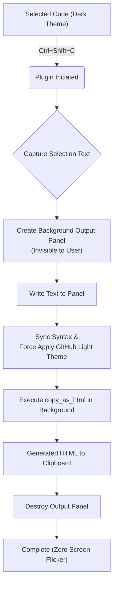

# Sublime-copy-as-github-light-html
Copy code with a custom GitHub Light-based style in Sublime Text 4.

🌏 **Read this in other languages:**  
[🇨🇳 中文 README](README.zh-CN.md)

Based on Sublime Text's native **Edit → Copy as HTML** function, 
this tool implements a "GitHub White Style" HTML copy solution that is **independent of the current editor theme**.

> **Goal:** To copy HTML with syntax highlighting and font styles as "What You See Is What You Get" (WYSIWYG), where the styling is custom-defined rather than restricted by the current theme or external tools like SublimeHighlighter.

The styling references the GitHub Light theme, with slight adjustments made to the comment color. It looks approximately like this:


---

## Feature Overview

- Uses the **Native** `Copy as HTML` function (not a third-party plugin like ExportHtml).
- Customization includes:
  - Color Scheme (`GitHub_Light_AAS.sublime-color-scheme`)
  - Font Face (e.g., `Consolas`)
  - Font Size (Default 11pt)
- One-click copy of the current selection as HTML, **independent of the editor's current theme**.

Default Shortcut: `Ctrl + Shift + C` (Can be modified)

---
## ⚙️ Technical Principle (How it Works)

The core mechanism relies on Sublime Text's **Output Panel** feature to construct an invisible "Ghost View" for format conversion. This fundamentally differs from the traditional "modify main window theme → copy → restore" approach.

### Core Flow

1.  **Capture Selection**:
    The plugin first captures the user's selected text in the active view (supports multiple cursors).

2.  **Create Ghost Panel**:
    A hidden text buffer is created in memory using `window.create_output_panel('ghost_copier_panel')`. This panel is invisible and does not cause visual interference.

3.  **Style Isolation & Injection**:
    * The captured text is written into the panel.
    * **Syntax Sync**: The current file's syntax (e.g., Python/C++) is assigned to the panel to ensure accurate highlighting logic.
    * **Force Style**: The custom `.sublime-color-scheme` (e.g., GitHub Light) and font settings (`Consolas`) are forcefully applied to this invisible panel. The main editor remains dark, while the background panel turns into the light theme.

4.  **Native Rendering Export (Native Rendering)**:
    The native Sublime Text 4 `copy_as_html` command is executed within the panel's context.
    * The `enclosing_tags: True` parameter is enabled.
    * This is crucial: it forces ST4 to generate an outer `<div>` tag containing the necessary styles, such as `style="background-color: ...; font-family: Consolas; ..."`.

5.  **Cleanup**:
    Immediately after copying, `window.destroy_output_panel` is executed to destroy the panel and free memory.

### Flowchart



### 💡 Why This Approach?

* **Zero Flash**: Because all style changes occur in an invisible **Output Panel**, the main editor's color scheme is never modified, preventing the jarring "dark → white → dark" screen flicker common in traditional methods.

* **Anti-Formatting Stripping (OneNote Compatible)**: By forcefully setting `font_face` to **`Consolas`** in the isolated panel, the generated HTML includes explicit `font-family` declarations. This effectively prevents **OneNote/Word** from resetting the code font to Calibri or Microsoft YaHei upon pasting.

* **Native Fidelity**: Relying on the **ST4**'s own rendering engine to generate HTML results in a more perfect rendition of the syntax highlighting details than external plugins (like Pygments).

***

## 🛠️ Configuration & Installation

This project consists of two files: one Python plugin file and one `.sublime-color-scheme` theme file.

### Step 1: Create the Custom Plugin (`.py`)

1.  In the Sublime Text menu, click **Tools -> Developer -> New Plugin...**.
2.  Download the `CopyCustomizedStyle.py` script from the repository and copy its content into the new file.
3.  Save the file in the **`Packages/User`** directory.

### Step 2: Import the Custom Style (`.sublime-color-scheme`)

This theme is based on the GitHub Light theme, with slight adjustments to the comment color and font style.

1.  Access your Sublime Text User folder: **Preferences -> Browse Packages -> User**.
2.  Download `GitHub_Light_AAS.sublime-color-scheme` and copy it into the **`Packages/User`** directory.

### Step 3: Bind the Shortcut

1.  Click **Preferences -> Key Binding**.
2.  Add the following configuration to the right-side user file:

```json
[
    {
        "keys": ["ctrl+shift+c"],
        "command": "copy_customized_style"
    }
]
```

### Step 4: Usage

Select your code and press <kbd>Ctrl</kbd> + <kbd>Shift</kbd> + <kbd>C</kbd> to **copy the content with the custom style** (independent of the editor's current theme).

***

### 📚 Style Reference

* [GitHub Theme for Sublime Text](https://github.com/mauroreisvieira/github-sublime-theme)
