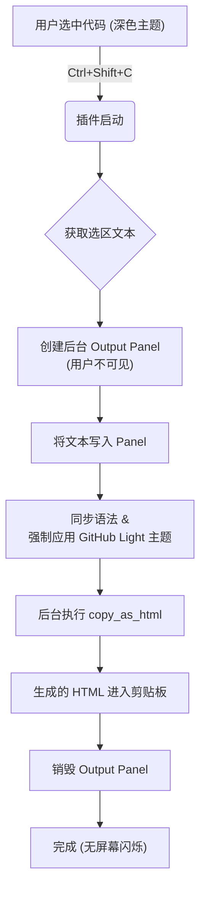

# Sublime-copy-as-github-light-html
copy the code as github light based style with own design in the sublime text 4

🌏 **Read this in other languages:**  
[🇺🇸 English README](README.md)

基于 Sublime Text 自带的 **Edit → Copy as HTML** 功能，  
实现一个**独立于当前编辑器主题**的「GitHub 白色风格」HTML 复制工具。

> 目标：所见即所得（WYSIWYG）地复制带语法高亮 + 字体样式的 HTML，
> 且样式由我们自定义，而不是被当前主题 / SublimeHighlighter 限制。

样式参考自 GitHub Light 主题，并对 `comment` 的颜色做了轻微调整。大概长这样：


---

## 功能概览

- 使用 **原生** `Copy as HTML` 功能（不是第三方 ExportHtml 插件）
- 自定义：
  - 颜色主题（`GitHub_Light_AAS.sublime-color-scheme`）
  - 字体名称（如 `Consolas`）
  - 字号（默认11）
- 一键复制当前选中代码为 HTML，**与编辑器当前主题无关**

默认快捷键：`Ctrl + Shift + C`（可自行修改）

---
## ⚙️ 技术原理 (How it Works)

本插件的核心在于利用 Sublime Text 的 **Output Panel (输出面板)** 机制，构建了一个用户不可见的“幽灵视图”来完成格式转换。这与传统的“修改主窗口主题 -> 复制 -> 恢复主题”的方法有本质区别。

### 核心流程

1.  **捕获选区 (Capture Selection)**:
    插件首先获取当前视图中用户选中的文本（支持多光标）。

2.  **创建幽灵面板 (Create Ghost Panel)**:
    利用 `window.create_output_panel('ghost_copier_panel')` 在内存中创建一个隐形的文本缓冲区。这个面板默认是隐藏的，不会对用户当前的 UI 造成任何视觉干扰。

3.  **样式隔离注入 (Style Injection)**:
    * 将捕获的文本写入面板。
    * **同步语法**: 将当前文件的语法（如 Python/C++）赋予面板，确保高亮逻辑一致。
    * **强制样式**: 对这个隐形面板应用自定义的 `.sublime-color-scheme` (如 GitHub Light) 和字体设置 (`Consolas`)。此时，主编辑器依然保持深色主题，而后台的幽灵面板已变为浅色高对比度样式。

4.  **原生渲染导出 (Native Rendering)**:
    在面板内部调用 Sublime Text 4 原生的 `copy_as_html` 命令。
    * 开启 `enclosing_tags: True` 参数。
    * 这一步至关重要，它迫使 ST4 生成带有 `style="background-color: ...; font-family: Consolas; ..."` 的外层 `<div>` 标签。

5.  **清理现场 (Cleanup)**:
    复制完成后，立即执行 `window.destroy_output_panel` 销毁面板，释放内存。

### 流程图



### 💡 为什么选择这个方案？

* **零闪烁 (Zero Flash)**: 因为所有的样式变更都发生在一个不可见的 **`Output Panel`** 中，主编辑器的颜色方案从未被修改，从而避免了传统方案中刺眼的“黑->白->黑”屏幕闪烁。

* **对抗格式清洗 (OneNote Compatible)**: 通过在独立面板中强制指定 `font_face` 为 **`Consolas`**，生成的 HTML 会包含显式的 `font-family` 声明。这有效地防止了 **OneNote/Word** 在粘贴时将代码字体强制重置为 Calibri 或 Microsoft YaHei。

* **原生高保真**: 依赖 **ST4** 自身的渲染引擎生成 HTML，比第三方插件（如 Pygments）能更完美地还原 Sublime Text 的语法高亮细节。
---

## 🛠️ 配置过程 (安装)

该项目仅由两个文件构成：一个 Python 插件和一个 `.sublime-color-scheme` 主题文件。

### 步骤 1：创建自定义插件 (`.py`)

1.  在 Sublime Text 菜单栏点击 **`Tools`** -> **`Developer`** -> **`New Plugin...`**。
2.  下在仓库当中的 **`CopyCustomizedStyle.py`** 脚本然后复制到`Packages/User`当中。

### 步骤 2：导入自定义样式 (`.sublime-color-scheme`)

该样式基于 GitHub Light主题，微调了注释颜色和字体样式。

1.  进入 Sublime Text 的 `User` 文件夹：`Preferences` -> `Browse Packages` -> **`User`**。
2.  将 **`GitHub_Light_AAS.sublime-color-scheme`** 下载并复制过去

### 步骤 3：绑定快捷键

1.  点击 `Preferences` -> `Key Binding`。
2.  在右侧的用户配置文件中，添加以下配置：

```json
[
    {
        "keys": ["ctrl+shift+c"],
        "command": "copy_customized_style"
    }
]
```

### 步骤 4：使用方法
选中代码后，按下 <kbd>Ctrl</kbd> + <kbd>Shift</kbd> + <kbd>C</kbd> 即可复制为自定义后的样式（与编辑器样式独立）。

---

### 📚 样式来源参考

* [GitHub Theme for Sublime Text](https://github.com/mauroreisvieira/github-sublime-theme)

